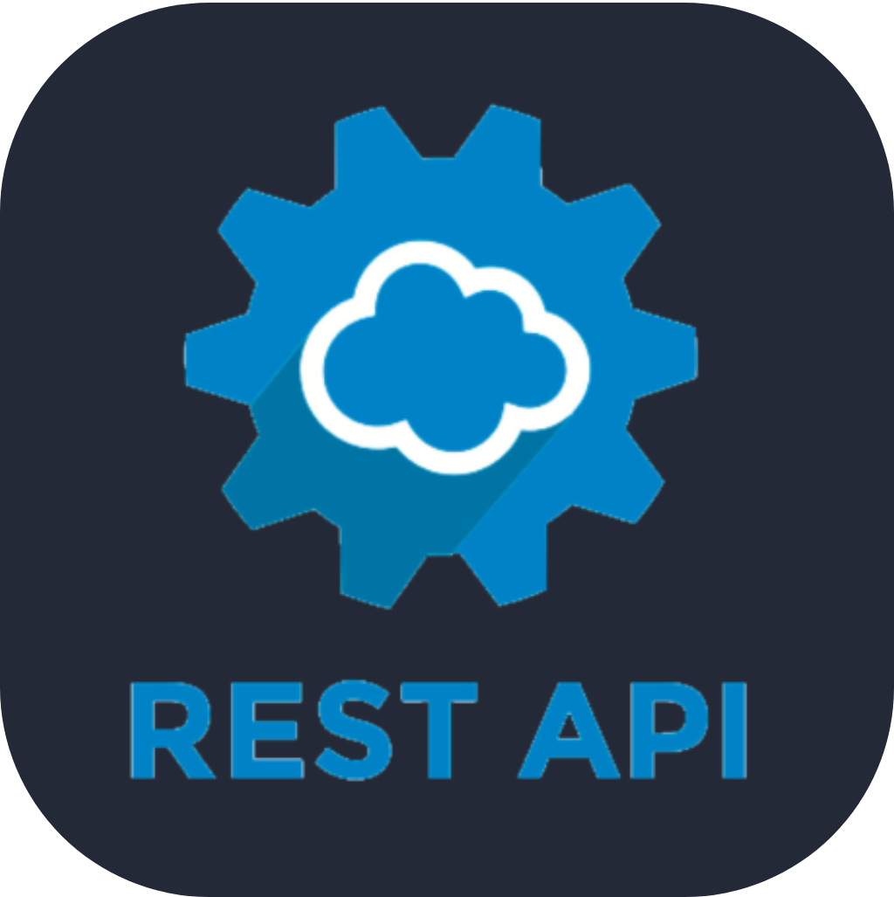
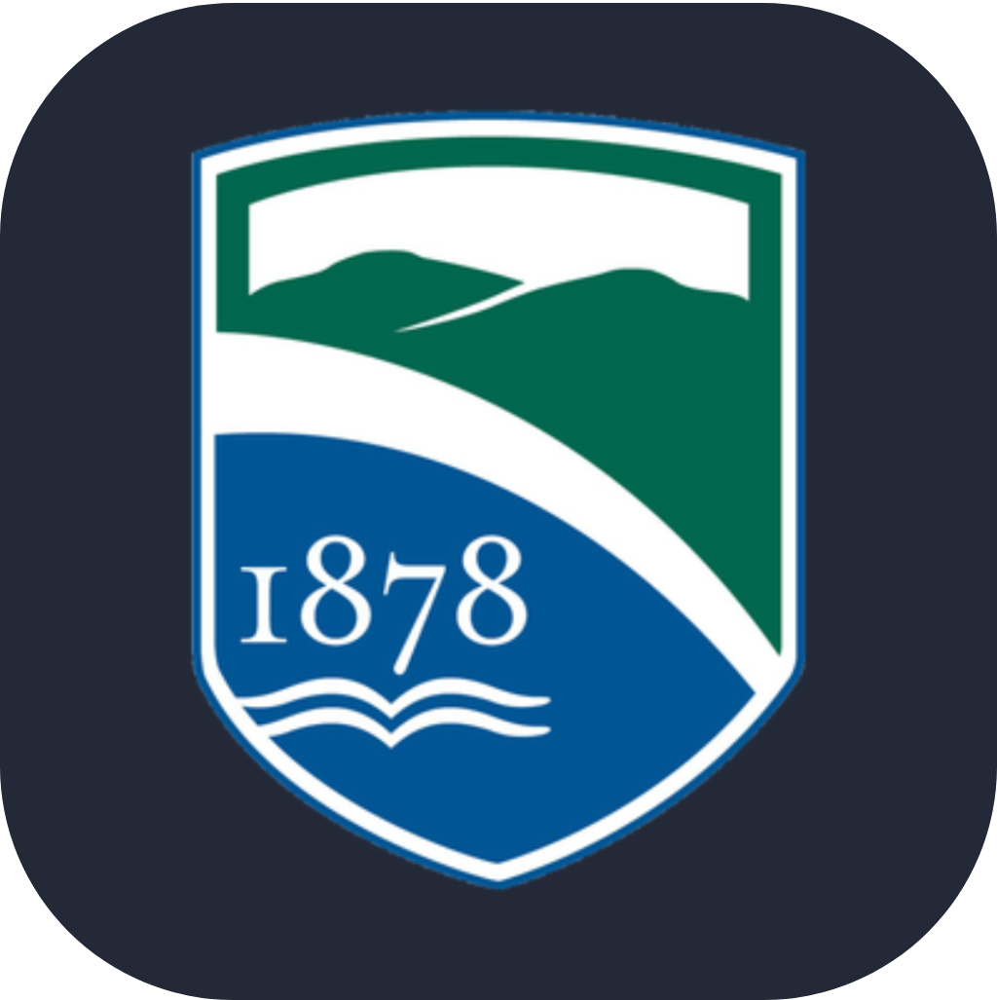

<pre><h3>Hi there</h3>👋 I'm Umut, and I’m a Computer Science student.
🌱 I’m currently learning Python Backend Development.
📍 Location: Ankara, Turkey
<h4>Interested Technologies</h4><h4>Education</h4> <strong>Champlain College — B.S. in Computer Science</strong>
</pre>
<!--   
<table>
<tr>
    <td align="center" width="96">
         Python
    </td>
        <td align="center" width="96">
         FastAPI
    </td>
    <td align="center" width="96">
         PostgreSQL
    </td>
    <td align="center" width="96">
         Docker
    </td>
    <td align="center" width="96">
         Git
    </td>
        <td align="center" width="96">
         Linux
    </td>
</tr>
</table> 

**umut-ozkan-dev/umut-ozkan-dev** is a ✨ _special_ ✨ repository because its `README.md` (this file) appears on your GitHub profile.
Here are some ideas to get you started:
- 🔭 I’m currently working on ...
- 🌱 I’m currently learning ...
- 👯 I’m looking to collaborate on ...
- 🤔 I’m looking for help with ...
- 💬 Ask me about ...
- 📫 How to reach me: ...
- 😄 Pronouns: ...
- ⚡ Fun fact: ...
