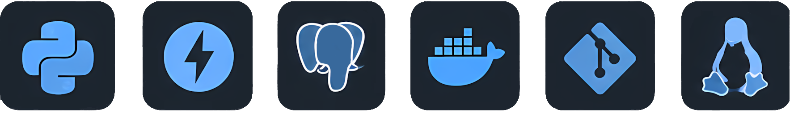

<pre><h4>Hi there👋</h4>I'm Umut, and I’m a Computer Science student.
I’m currently learning Python Backend Development.
<h4>Tech Stack :</h4>    
<strong>Languages:</strong> Python
<strong>Backend Framework:</strong> FastAPI
<strong>Database:</strong> PostgreSQL
<strong>Tools:</strong> Git, GitHub, Linux, Docker<h4>Education :</h4> <strong>Champlain College — B.S. in Computer Science</strong>
<h4>Contact</h4>📧 Email: <a href="mailto:umutozkan123456@gmail.com">umutozkan123456@gmail.com</a>
💼 LinkedIn: <a href="https://www.linkedin.com/in/umut-ozkan-dev">in/umut-ozkan-dev</a>
📍 Location: Ankara, Turkey
</pre>
