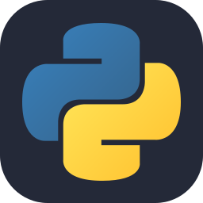

## Hi there 👋

-  I'm Umut and I’m currently studying in Champlain College for B.S Computer Science degree. 
- 🌱 I’m currently learning Backend Development.

 

  
## 🛠️ Tech Stack & Tools

<table>
<tr>
    <td align="center" width="96">
        
         Python
    </td>
    <td align="center" width="96">
        
         PostgreSQL
    </td>
    <td align="center" width="96">
        
         FasAPI
    </td>
    <td align="center" width="96">
        
         Firebase
    </td>
    <td align="center" width="96">
        
         Git
    </td>
</tr>
</table>

<!--
**umut-ozkan-dev/umut-ozkan-dev** is a ✨ _special_ ✨ repository because its `README.md` (this file) appears on your GitHub profile.

Here are some ideas to get you started:

- 🔭 I’m currently working on ...
- 🌱 I’m currently learning ...
- 👯 I’m looking to collaborate on ...
- 🤔 I’m looking for help with ...
- 💬 Ask me about ...
- 📫 How to reach me: ...
- 😄 Pronouns: ...
- ⚡ Fun fact: ...
-->
